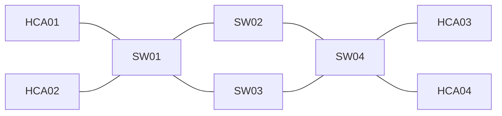

# infiniband-lab

**Learn how an InfiniBand fabric is managed - without any InfiniBand hardware.**
A Docker lab that runs a simulated fabric ([ibsim](https://github.com/linux-rdma/ibsim)) controlled by a real
[OpenSM](https://github.com/linux-rdma/opensm) Subnet Manager and inspected with the real
[`infiniband-diags`](https://github.com/linux-rdma/rdma-core) tools. 14 hands-on exercises cover LIDs, GUIDs, GIDs,
the Subnet Manager, Linear Forwarding Tables, path tracing, link failure and SM failover.

> Built to *experiment* with InfiniBand fundamentals rather than memorise them. Independent project - not affiliated with or
> endorsed by NVIDIA. It simulates the **management plane only**; see [Limitations](#limitations).


Cut a link, watch OpenSM sweep and rewrite the forwarding tables, then compare the new route. A real session is in
[`docs/sample-session.txt`](docs/sample-session.txt); the live-generated topology is [`docs/topology-redundant.svg`](docs/topology-redundant.svg).

## Quick start (any Linux host with Docker; no kernel modules, no privileges)
```bash
git clone <this repo> && cd infiniband-lab
scripts/lab up            # build image (Ubuntu 24.04 + ibsim-utils, opensm, infiniband-diags) and start the container
scripts/lab shell         # prompt inside the lab, simulator environment preloaded
reset-lab.sh redundant    # inside: 4-switch diamond fabric + OpenSM on HCA01   (or: simple)
```
First five commands: `ibnetdiscover` -> `sminfo` -> `ibaddr` -> `ibroute 2 | lft-table.py` -> `ibtracert 1 8`.
Then break something: `simcmd 'Unlink "S-0002c90000000100"[4]'`, wait ~12 s, run `ibtracert 1 8` again. Stop: `stop-lab.sh`, `scripts/lab down`.

## How it works
`ibsim` loads a topology (`topology/*.net`, generated by `scripts/gen-net.py`) and serves management datagrams on a local socket.
`libumad2sim.so`, injected with `LD_PRELOAD` (`scripts/env.sh`), replaces the user-space MAD library, so `opensm`, `ibnetdiscover`,
`ibroute` ... talk to the simulator instead of `/dev/infiniband/umad*`. `SIM_HOST=<node>` picks which simulated node a tool "runs on".
OpenSM sees a normal fabric: it discovers it, assigns LIDs, computes routes and programs each switch's LFT.

## What's inside
| Path | What |
|---|---|
| `exercises/` | 14 exercises (12 hands-on, 2 conceptual and labelled as such) |
| `answers/` | challenge solutions (spoilers) |
| `CHEATSHEET.md` | concept table: LID / GUID / GID / SM / SA / LFT + the command that shows each |
| `notes/tool-matrix.md` | which diagnostic tools work against ibsim - measured, not assumed |
| `scripts/` | lifecycle scripts, `lft-table.py` (LFT as a table), `topo-dot.py` (live topology to DOT/SVG), `challenge.sh` |
| `docs/` | sample session, topology SVG |

The exercises make you type the diagnostics yourself; the helpers only format what the real tools print.

## Validation (Ubuntu 24.04, ibsim 0.10, OpenSM 3.3.23, infiniband-diags 50.0)
| Feature | Result |
|---|---|
| ibsim topology load; OpenSM DISCOVERING -> LIDs -> LFTs -> SUBNET UP | PASS |
| `ibnetdiscover`, `ibhosts`, `ibswitches`, `iblinkinfo`, `sminfo`, `ibaddr`, `saquery`, `smpquery`, `ibroute`, `ibtracert` | PASS |
| Link failure -> sweep -> LFT change -> restore (routes may differ from the originals) | PASS |
| SM stop / no-SM black hole; two SMs: priority election + standby failover (~60 s) | PASS |
| `ibstat` (fake `ibsim0` device), `perfquery` (counters always 0) | PARTIAL |
| `ibv_devinfo`, verbs, `ibping` | N/A - need a real HCA |
| P_Keys (`smpquery pkey` unsupported by ibsim) | not simulated - Exercise 13 is reading only |
| Multi-subnet / IB router | not simulated - Exercise 12 is conceptual |

## Limitations
Management plane only: no data plane, no RDMA/verbs, no real link speeds (the "10 Gbps 4X" in `iblinkinfo` is a number in the topology
file), no GPUDirect RDMA, NCCL, SHARP, congestion or adaptive routing, no Quantum/ConnectX-specific behaviour. When the exercises feel
comfortable, the next step is a short rental of a real 2-node InfiniBand GPU machine (`ibstat`, `ib_write_bw`, `perfquery` under load).

## License
MIT - see [LICENSE](LICENSE).
